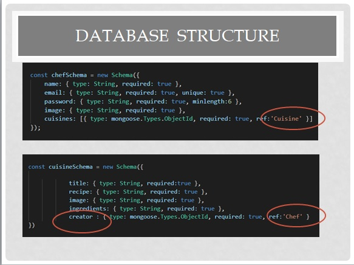
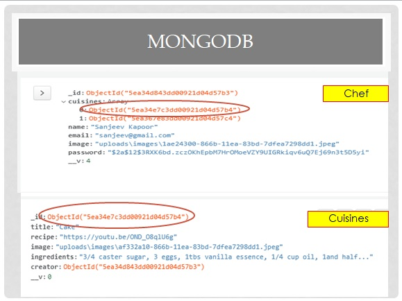
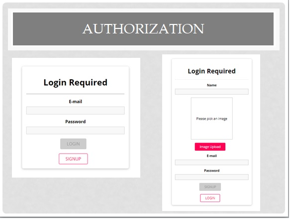
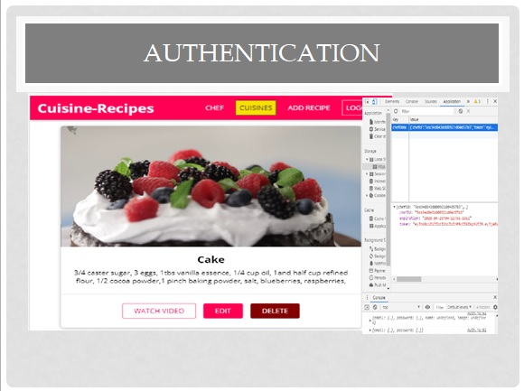
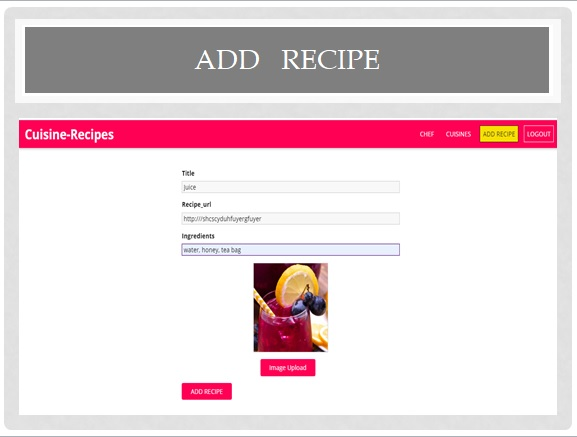
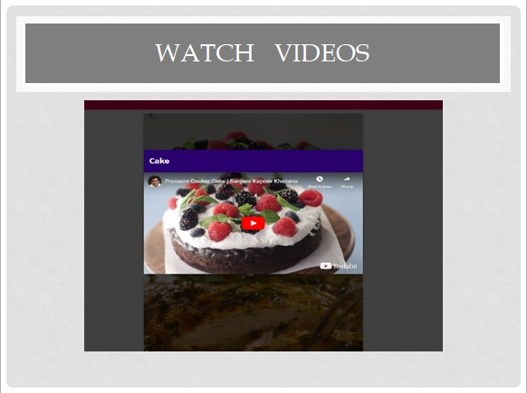
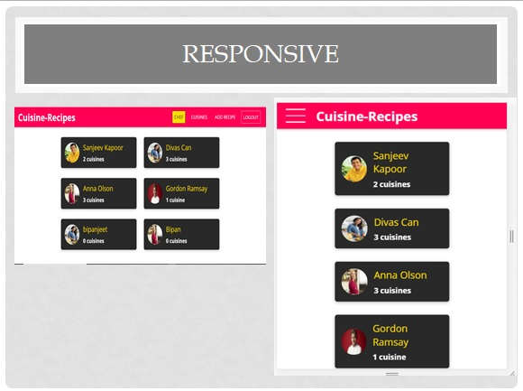

# Cuisine-Recipe
This application is design to give platform to chefs to share their cuisine recipes with public.At home page all chef's information is available with number of cuisines.This app is responsive and progressive.It has feature to upload images, videos and accept validated data only

# User Story
 User have user friendly interface to interact with cuisine recipes, watch videos and user can add their own recipes by valid authorization.

# Business View:
 We can enhance the functionality of this app in future by adding more features like type of cuisine, share the recipe, download it ,show rating  stars etc.

# Technology :

Front End Technology
    -React
    -Custom hooks
    -react- Player
    -React – dom 
    -React – router – dom 
    -React – transition –group 
    
Back-End Technology
    -NodeJS 
    -Bcrypt 
    -Express – validation 
    -Json Web Token 
    -Multer
    -.dotenv
    -Mongoose 
# Database 

 
# Demo

# Live Demo

# Deployment  Links

https://exotic-cuisine.herokuapp.com/
